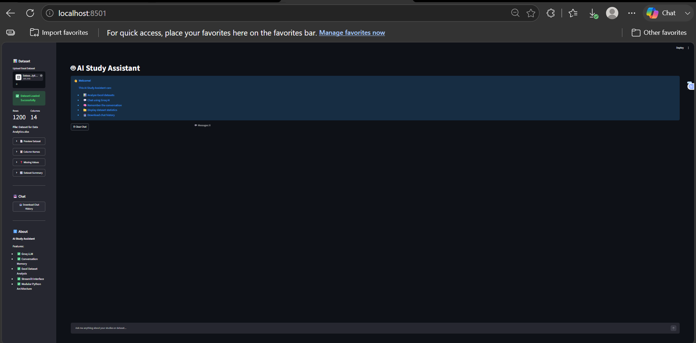
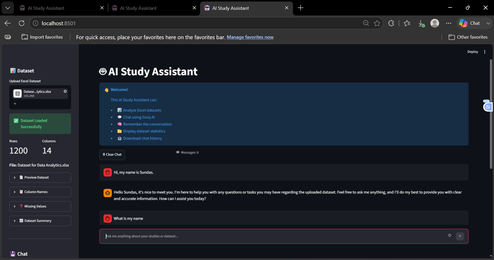
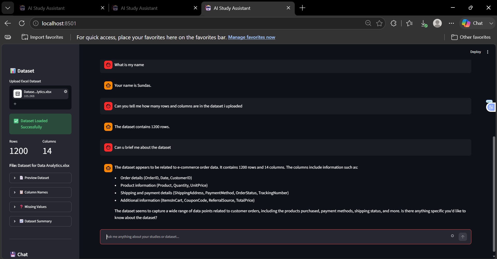
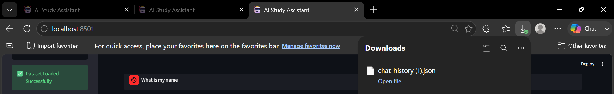

# 🤖 AI Study Assistant

An AI-powered Study Assistant built with **Streamlit**, **Groq LLM**, and **Pandas**. This application allows users to upload Excel datasets, chat with an AI assistant, analyze uploaded data, maintain conversation history, and export chat conversations.

---

## ✨ Features

- 🤖 AI-powered chatbot using Groq API
- 📊 Upload and analyze Excel (.xlsx) datasets
- 💬 Conversation memory
- 📈 Dataset preview and statistics
- 📋 Display dataset columns
- ⚠️ Missing value analysis
- 📑 Dataset summary
- 📥 Export chat history
- 🎨 Clean Streamlit interface

---

## 📁 Project Structure

```
AI_STUDY_ASSISTANT/
│
├── assets/
│   ├── ai_dataset_answer.png
│   ├── chat_download.png
│   ├── dataset_upload.png
│   └── home_page.png
│
├── config/
│   └── settings.py
│
├── services/
│   ├── data_assistant.py
│   ├── dataset_loader.py
│   ├── export_chat.py
│   ├── llm.py
│   └── memory.py
│
├── .env
├── .env.example
├── .gitignore
├── app.py
├── README.md
└── requirements.txt
```

---

## 🛠️ Technologies Used

- Python
- Streamlit
- Groq API
- Pandas
- OpenPyXL
- python-dotenv
- Tiktoken

---

## 🚀 Installation

### 1. Clone the repository

```bash
git clone https://github.com/sundas-abrar/AI_STUDY_ASSISTANT.git
cd AI_STUDY_ASSISTANT
```

### 2. Create a virtual environment

```bash
python -m venv venv
```

### 3. Activate the virtual environment

**Windows**

```bash
venv\Scripts\activate
```

### 4. Install dependencies

```bash
pip install -r requirements.txt
```

### 5. Create a `.env` file

```env
GROQ_API_KEY=your_groq_api_key_here
```

### 6. Run the application

```bash
streamlit run app.py
```

---

## 📷 Application Preview

### 🏠 Home Page



---

### 📤 Upload Dataset



---

### 🤖 AI Answer Using Uploaded Dataset



---

### 📥 Export Chat



---

## 📦 Requirements

```
streamlit>=1.47.0
groq>=0.31.0
pandas>=2.3.0
openpyxl>=3.1.5
python-dotenv>=1.1.1
tiktoken>=0.10.0
```

---

## 👩‍💻 Author

**Sundas Abrar**

GitHub: https://github.com/sundas-abrar

---

## 📄 License

This project is created for educational purposes.